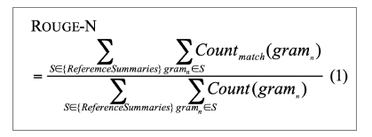
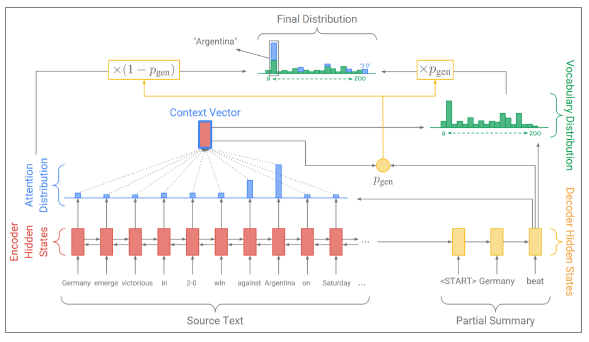

# cs224n Text Summarization part 
stanford university의 2019년 NLP 강좌인 cs224n의 15강. Natural Language Generation 강의 중 'Text Summarization' 부분을 참고정리한다.

참조: [cs224n-Lecture15-Natural Language Generation](http://web.stanford.edu/class/cs224n/slides/cs224n-2019-lecture15-nlg.pdf)

---------------------

### 1. Summarization : Task Definition

**Task Definition**: 입력 텍스트 x가 주어지면, x보다 짧으며 주요한 정보를 담고있는 요약된 y를 작성한다.

#### Task는 Single-Document / Multi-Document로 구분하여 진행한다. 
>> - **Single-Document**: 단일 문서 x를 요약하여 하나의 y를 작성한다.

>> - **Multi-Document**: 다중의 문서 x1,,,xn을 요약하여 하나의 요약 y를 작성한다.
  
    일반적으로 x1,,,xn은 겹치는 내용이 있는 content이다.  e.g. News articles about the same event

Summarization은 어떠한 task이며, 관련한 연구, 데이터셋 그리고 코드등을 정리한 깃헙. 

- **list of summarizatioin datasets, papers, and codebases**

https://github.com/mathsyouth/awesome-text-summarization

> Single-Document 요약에서는, 서로 다른 길이와 스타일의 문서들이 있는 다양한 데이터셋이 존재한다.
>> - **Gigaword**: first one or two sentences of a news article -> headline
>>  (aka **sentence compression**)
>> - **LCSTS**(Chinese microblogging): paragraph -> sentence summary
>> - **NYT, CNN/DailyMail**: news article -> (multi)sentence summary
>> - **Wikihow**: full how-to article -> summary sentences

> **Sentence Simplification**은 다르지만, 유사한 task이다. 
: rewrite the source text in a simpler (sometimes shorter) way
>> - Simple Wikipedia : standard Wikipedia sentence -> simple version
>> - Newsela : news article -> version written for children

#### Summarization: two main strategies
>> - **Extractive Summarization**: 요약을 형성하기 위해서 원본 텍스트에서 부분들을 선택한다. (typically sentences)
>>    Easier / Restrictive (no parphrasing)
>> - **Abstractive Summarization**: Natural Language Generation(NLG) 기술들을 활용해서 새로운 텍스트를 생성한다. 
>>    More difficult / More flexible (more human)

#### Pre-neural summarization
Pre-neural summarization은 대개 extractive(추출적) 방식이었다.

> **Pipeline**:
>> - **Content selection** : 포함할 문장들을 몇가지 선택한다.
>> - **Information ordering**: 선택한 문장들의 순서를 정한다.
>> - **Sentence realization** : 문장들의 순서를 수정한다. (e.g. 단순화, 부분들 제거, 연결성 문제들을 수정)

> pre-neural **content selection** algorithms:
>> - **Sentecne scoring functions**은 다음의 항목을 기반으로 할 수 있다.:
>>>- Presence of topic keywords, e.g.tf-idf 등을 통해서 계산
>>>- 문서에서 해당 문장이 어디에 나타났는지 등에 관한 변수들
>> - **Graph-based algorithms**은 문서를 각각의 문장쌍을 edge로 가지는 문장(node)들의 집합으로 본다.
>>>- Edge weight는 문장 유사도에 비례한다.
>>>- graph algorithms을 사용해서 어떤 문장들이 그래프에서 central한지 확인한다.

### 2. Summarization Evaluation : ROUGE

**ROUGE** (Recall-Oriented Understudy for Gisting Evaluation)

- [ROUGE : A pakage for Automatic Evaluation of Summaries, Lin, 2004](https://www.aclweb.org/anthology/W04-1013 )

BLEU와 같이, n-gram overlap을 기반으로 한다. 

차이는:
- ROUGE는 brevity penalty가 없다.
- ROUGE는 recall을 기반으로 하고, BLEU는 precision을 기반으로 한다.
 > - 논쟁의 여지가 있지만, Machine Translation (번역) task에서는 precision이 더 중요한 역할을 한다. (그래서 brevity penalty를 줘서 under-translation을 잡는다.), recall은  summarization에서 더욱 중요하다. (최대 길이에 대한 제약이 있다고 가정해봐라)
 > - 그러나, F1(precision + recall) 버젼의 ROUGE도 사용된다. 
- BLEU는 n=1,2,3,4 n-grams의 조합으로 구성된 하나의 숫자를 형성한다.
- ROUGE는 각각의 n-gram에 대해서 개별적인 점수를 형성한다.
- 가장 일반적으로 사용되는 ROUGE score는:
> - ROUGE-1 : unigram overlap
> - ROUGE-2 : bigram overlap
> - ROUGE-L : longest common subsequence overlap

- **python implementation of ROUGE**

  https://github.com/google-research/google-research/tree/master/rouge 

### 3. Neural Summarization (2015 ~ )

- 2015 : Rush et at. 처음으로 seq2seq summarization 논문을 발표함
- Single-Document abstractive summarization은 translation task이다!
- 따라서 일반적인 seq2seq + attention NMT 방법들을 적용가능하다.

- [A Neural Attention Model for Abstractive Sentence Summarization, Rush et al, 2015]( https://arxiv.org/pdf/1509.00685.pdf )

2015년 이후로, 다양한 발전들이 있었다.
> - 더 쉽게 copy할 수 있도록 함
>>- 하지만, 너무 많은 copy를 하지 않도록 방지
> - Hierarchical / multi-level attention
> - more global / high-level content selection
> - Reinforcement Learning를 사용해서 ROUGE 혹은 다른 이산적인 목표(e.g.length)를 직접적으로 최대화시킴
> - pre-neural 아이디어를 차용해서 (e.g. graph algorithms for content selection) neural system에서 동작하도록 함
> - ...

- [A survey of Neural Network-Based Summarization Methods, Dong, 2018]( https://arxiv.org/pdf/1804.04589.pdf )

#### 3.1. Neural summarization : copy mechanisms

Seq2seq + attention 시스템은 자연스로운 output을 형성하는데 뛰어났으나, details (like rare words)를 정확하게 복사하는데 성능이 저조했다.

- **Copy mechanisms**은 seq2seq 시스템이 입력에서 출력으로 단어들과 구절들을 쉽게 복사할 수 있도록 attention을 사용한다.
> - 명백하게 summarization에서 매우 유용하다.
> - copying과 generating을 모두 허용하는 것은 hybrid extractive/abstractive 접근을 가능하게 한다.

- copy mechanism에 변조를 준 다양한 논문들이 존재한다.
> - [Language as a Latent Variable : Discrete Generative Models for Sentence Compression, Miao et al, 2016]( https://arxiv.org/pdf/1609.07317.pdf )

> - [Abstractive Text Summarization using Sequence-to-sequence RNNs and Beyond, Nallapati et al, 2016]( https://arxiv.org/pdf/1602.06023.pdf )

> - [ncorporating Copying Mechanism in Sequence-to-Sequence Learning, Gu et al, 2016]( https://arxiv.org/pdf/1603.06393.pdf )

++copy mechanism의 한 예시++

- [Get To the Point: Summarization with Pointer-Generator Networks, See et al, 2017](https://arxiv.org/pdf/1704.04368.pdf)

- copy mechanism 의 큰 문제:
> - copy too much !
>> - mostly long phrases, sometimes even whole sentences
> - abstractive 해야할 시스템이 대개 extractive 한 시스템으로 붕괴됨

- 다른 문제:
> - overall content selection 가 저조한 성능으로 보임, 특히 입력 문서가 길 때
> - selecting content를 할 때 overall strategy 가 없음

#### Neural summarization : better content selection

- pre-neural 요약은 content selection과 surface realization (i.e. text generation)이 분리된 단계를 가졌음
- 일반적인 seq2seq + attention 요약 시스템은, 이 두 단계가 합쳐져있음
>> - decoder의 각 단계에서 (i.e.surface realization), word-level content selection (attention)을 실시함
>> - This is bad: no global content selection strategy

- one solutioin : **bottom-up summarization**

### 4.Bottom-up summarization

copy mechansim의 단점인 copy too much 현상을 극복
- content selection stage : 
    Neural sequence-tagging 모델을 사용해서 'include', 'don't-include'로 단어들에 태깅을 실시
    
- bottom-up attention stage :
  seq2seq + attention 시스템은 'don't include'로 태그된 단어들을 attend할 수 없음 (apply a mask)
  

simple but effective !
> - Better overall content selection
> - Less copying of long sequences (i.e. more abstractive output)

- [Bottom-Up Abstractive Summarization, Gehrmann et al, 2018]( https://arxiv.org/pdf/1808.10792v1.pdf )

### 5.Neural Summarization via Reinforcement Learning

- 2017 Paulus et al. 'deep reinforced' summarization model을 발표
- main idea: Use RL to directly optimze ROUGE-L
> - 대조적으로, 일반적인 Maximum Likelihood (ML)의 훈련은 미분불가능한 ROUGE-L을 직접적으로 최적화시킬 수 없음
> - interesting finding:
>> - RL을 ML 대신에 사용하는 것은 ROUGE 점수는 더 높게 가져오지만, human judgement 점수는 더 낮다.

- [A Deep Reinforced Model for Abstractive Summarization, Paulus et al, 2017]( https://arxiv.org/pdf/1705.04304.pdf )

- blog post

 https://einstein.ai/

